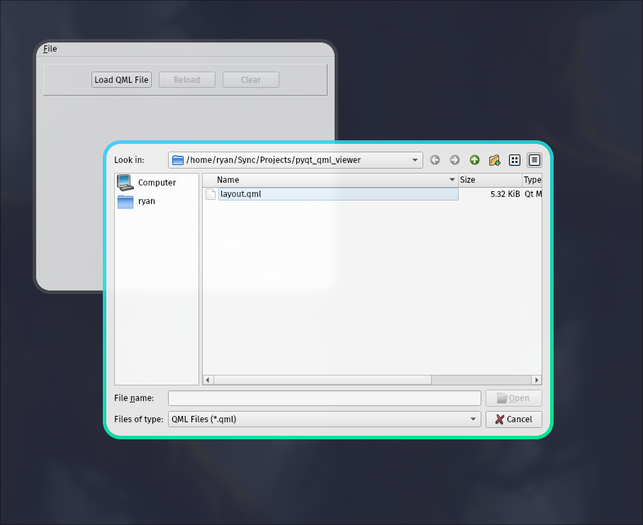
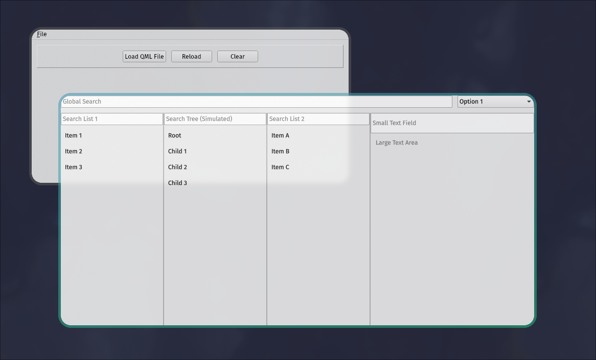

# QML Viewer

QML Viewer is a simple, standalone application for loading and viewing QML (Qt Modeling Language) files. It provides a convenient way to preview and test QML layouts and designs without the need for a full Qt/QML development environment.

## Features

- Load QML files from your local file system
- Reload the current QML file to see changes in real-time
- Clear the current QML view
- Simple and intuitive user interface
- Keyboard shortcuts for quick actions






## Requirements

- Python 3.6+
- PySide6

## Installation

### Pipx

Installation can be performed through pipx. If you don't have pipx installed, you can install it by following the instructions [here](https://pipxproject.github.io/pipx/installation/).

   ```bash
   pipx install git+https://github.com/ryangreenup/qml-viewer
   ```

### Manual

1. Clone the repository:

   ```bash
   git clone git+https://github.com/ryangreenup/qml-viewer
   cd qml-viewer
   ```
2. Install the dependencies:

   ```bash
   poetry install
   ```
3. Create a PATH entry (e.g. `~/.local/bin/py-qml-viewer`)

   ```bash
    #!/bin/bash
    cd /path/to/qml-viewer
    poetry run python qml_viewer.py
   ```

## Usage

Run the application:

```
# Installed
py-qml-viewer
```

Once the application is running:

1. Click "Load QML File" or use Ctrl+O to open a QML file.
2. The QML content will be displayed in the main window.
3. Use the "Reload" button or F5 to refresh the QML view after making changes to the file.
4. Use the "Clear" button or Ctrl+L to clear the current QML view.

## Keyboard Shortcuts

- Ctrl+O: Open QML file
- F5: Reload current QML file
- Ctrl+L: Clear QML view
- Ctrl+Q: Exit the application

## Contributing

Contributions are welcome! Please feel free to submit a Pull Request.

## License

This project is open source and available under the GPL licence. See the [LICENSE](LICENSE) file for more information.
